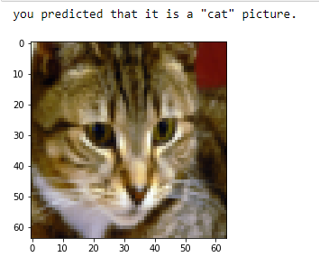
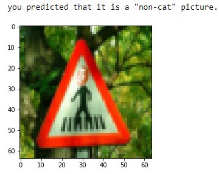

# catdetector
A simple L-Layer neural network  to classify images as cat and non-cat. You can input your own images near the end of the file. 80% accuracy. A few types of images the model tends to do poorly on include; 
* Cat body in an unusual position
* Cat appears against a background of a similar color
* Unusual cat color and species, Camera Angle
* Brightness of the picture
* Scale variation (cat is very large or small in image)

## examples

